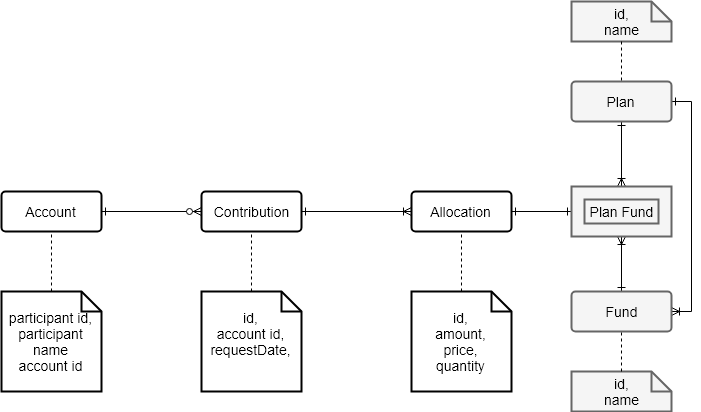

# account-service

Account service models and provides operations around the account subdomain in the group pension plan domain.
This services provides the following actions:
1. Create a new account for participant
2. Update the account when the participant enrolls in a plan.
3. Allow the participant to make contributions.
    1. The contribution is divided across the different plans by the contribution instructions that are set. (see account-instructions-service)
4. View the current balance of the account.

## Entity model



## Service operations
1. Create account for participant
    * REST Details - **POST** `/accounts/{participantId}`
        * Request Payload
          > No body
        * Response Payload
          > No body          
    * SOAP Endpoint - /services
        * Request Payload
            ```xml
            <CreateAccountRequest participant-id="{participantId}">
            </CreateAccountRequest>
            ```
        * Response Payload
            ```xml
            <CreateAccountResponse/>
            ```

2. Enroll participant in plan
    * REST Details - **POST** `/accounts/{participantId}/plans`
        * Request Payload
            ```json
              {
                 "planId": "{planId}"
              }
            ```   
        * Response Payload
          > No body          

    * SOAP Endpoint `/services`
       * Request Payload
          ```xml
          <EnrollParticipantInPlanRequest participant-id="{participantId}" plan-id="{planId}">
          </EnrollParticipantInPlanRequest>
          ```
       * Response Payload
          ```xml
          <EnrollParticipantInPlanResponse/>
          ```

3. Make contribution
    * REST Details - **POST** `/accounts/{participantId}/contributions`
        * Request Payload
            ```json
            amount
            ```
        * Response Payload
          > No body          
        
    * SOAP Endpoint `/services`
        * Request Payload
          ```xml
          <MakeContributionRequest participant-id="{participantId}" amount="{amount}">
          </MakeContributionRequest>
          ```
       * Response Payload
          ```xml
          <MakeContributionResponse/>
          ```
    
    This operation will:
    1. Get the contribution instructions from the account-instruction-service.
    2. Distribute the 'amount' based on the plan & fund split instructions.
        * For each plan
            * For each fund
                * allocation.amount = instructions.plan[planId].splitPercentage * instructions.plan[planId].fund[fundId].splitPercentage 
    3. Store the allocations.
    
    *For the current implementation do not store the price and quantity*

4. Get Account Balances
    * REST Details - **GET** `/accounts/{participantId}/balances`
        * Request Payload
          > No Body
        * Response Payload
            ```json
            {
                "plans":[{
                    "id":"{planId}",
                    "name":"{planName}",
                    "funds":[{
                        "id":"{fundId}",
                        "name":"{fundName}",
                        "contributions":[{
                            "amount":"{amount}",
                            "date":"{requestDate}"
                        }],
                        "total":"{total of contributions.amount}"
                    }],
                    "total":"{total of funds.total}"
                }]
                
            }
            ```
    * SOAP Endpoint `/services`
        * Request Payload
            ```xml
              <GetBalancesRequest participant-id="{participantId}">
              </GetBalancesRequest>
            ```    
        * Response Payload
            ```xml
              <GetBalancesResponse>
                <Plan id="{planId}" name="{planName}" total="{total of funds.amount}">
                    <Fund id="{fundId}" name="{fundName}" total="{total of contributions.amount}">
                        <Contribution amount="{amount}" date="{requestDate}"/>
                    </Fund>
                </Plan>
              </GetBalancesResponse>
            ```    
      